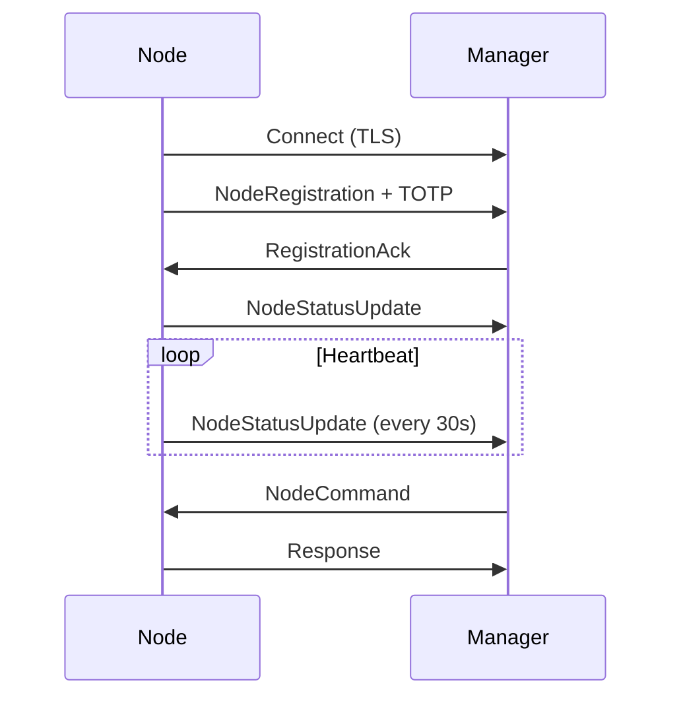

# HoneyBee Node Overview

The HoneyBee Node is a production-ready Go implementation that connects to the HoneyBee Core manager with enterprise-grade security features.

## What is a HoneyBee Node?

A HoneyBee Node is an individual honeypot instance that:
- Connects to the central HoneyBee Core manager
- Reports its status via periodic heartbeats
- Receives and executes commands from the manager
- Implements the HoneyBee Protocol v2
- Operates securely with TLS encryption and TOTP authentication

## Key Features

### 🔐 Security First

- **TLS 1.3 Encryption**: Secure communication using the latest TLS standard
- **TOTP Authentication**: Time-based one-time password for additional security
- **Certificate Validation**: Full certificate chain verification
- **Mutual TLS**: Optional client certificate authentication
- **Secure Storage**: TOTP secrets stored with 0600 permissions

### 🏗️ Production Ready

- **Clean Architecture**: Following Go best practices and project layout
- **Automatic Reconnection**: Resilient connection management with backoff
- **Graceful Shutdown**: Proper cleanup on termination signals
- **Structured Logging**: JSON and text formats with configurable levels
- **Resource Efficient**: Minimal CPU and memory footprint

### 📡 Protocol v2 Compatible

- Full implementation of HoneyBee Protocol v2
- JSON-based message format
- Bidirectional communication
- Version validation
- Extensible message types

### 🚀 Deployment Flexible

- **Single Binary**: No runtime dependencies
- **Cross-Platform**: Linux, Windows, macOS support
- **Containerized**: Docker and Kubernetes ready
- **Service Integration**: Systemd service files included
- **Configuration Management**: YAML-based configuration

## Node Types

### Agent Node (Lightweight)

```yaml
node:
  type: "Agent"
```

- Minimal resource usage
- Basic monitoring capabilities
- Quick deployment
- Ideal for edge locations

### Full Node

```yaml
node:
  type: "Full"
```

- Full honeypot capabilities
- Interactive deception workloads
- Advanced monitoring
- Rich attack surface

## How It Works

### 1. Connection Establishment

```
Node → Manager: TCP/TLS Connection
Node → Manager: NodeRegistration (with TOTP)
Manager → Node: RegistrationAck
Node → Manager: NodeStatusUpdate (Running)
```

### 2. Heartbeat Loop

```
Every 30 seconds:
  Node → Manager: NodeStatusUpdate (Running)
```

### 3. Command Processing

```
Manager → Node: NodeCommand("stop")
Node → Manager: NodeStatusUpdate (Stopped)
Node → Manager: NodeEvent(Stopped)
Node → Manager: NodeDrop
```

## Architecture

```
honeybee_node/
├── cmd/node/              # Application entry point
├── internal/
│   ├── auth/             # TLS + TOTP authentication
│   ├── client/           # Core client logic
│   ├── config/           # Configuration management
│   ├── logger/           # Structured logging
│   └── protocol/         # Protocol v2 definitions
└── configs/              # Configuration files
```

## Communication Flow



## System Requirements

### Minimum Requirements

- **OS**: Linux, Windows, macOS
- **Memory**: 10 MB
- **CPU**: Any modern CPU
- **Network**: TCP connectivity to manager
- **Disk**: 50 MB for binary and logs

### Recommended Requirements

- **OS**: Linux (Ubuntu 20.04+, Debian 11+, CentOS 8+)
- **Memory**: 20 MB
- **CPU**: 1 core
- **Network**: Stable connection, low latency to manager
- **Disk**: 500 MB for logs and data

## Performance Characteristics

- **Memory Usage**: ~10-15 MB typical
- **CPU Usage**: <1% idle, ~5% during activity
- **Network**: Minimal bandwidth (heartbeats only)
- **Startup Time**: <1 second
- **Reconnection**: Automatic with 5-second delay

## Next Steps

1. [Install and set up your first node](./installation.md)
2. [Configure security features](./security.md)
3. [Deploy to production](./deployment.md)

## Comparison with Other Implementations

| Feature | Go Node | Python Example | Rust Example |
|---------|---------|----------------|--------------|
| **Production Ready** | ✅ | ❌ (Example) | ❌ (Example) |
| **TLS 1.3** | ✅ | ❌ | ❌ |
| **TOTP Auth** | ✅ | ❌ | ❌ |
| **Auto Reconnect** | ✅ | ✅ | ✅ |
| **Structured Logging** | ✅ | ❌ | ❌ |
| **Configuration Files** | ✅ | ❌ | ❌ |
| **Docker Support** | ✅ | ❌ | ❌ |
| **Systemd Integration** | ✅ | ❌ | ❌ |
| **Documentation** | Extensive | Minimal | Minimal |

The Go implementation is the **recommended production node** with full security features and comprehensive documentation.

