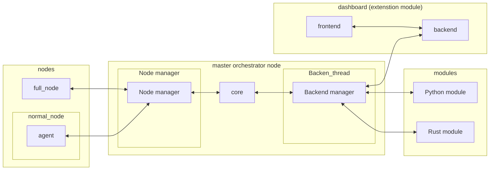

# HoneyBee: A Modular Honeypot Orchestration Framework for Network Security Enhancement

# technologies used
## rust (core)
The **core** component is written in Rust.
It is responsible for:
- Managing network connections to and from agents.
- Managing network connections to and from the inferfaces (modular extensions)
- Providing an interface for higher-level system control (via the dashboard backend).

The modular system is designed to allow extensions in any language and can later be enhanced with modules to add extra features.

## go (agents)
they are the part that interact with the honypot machine directly
They will:
- Expose control interfaces to the core for managing nodes.
- Report activity, telemetry, and captured data back to the core.
- Optionally extend functionality by utilizing unused ports or aggregating data from multiple devices in agent mode (office devices can be used as honeypots with no operational downsides).

Two types of agents are planned:
1. **Full Nodes** — fully controllable honeypot nodes managed directly by the orchestrator.
2. **Extension Nodes** — lightweight agents that run alongside existing services to monitor unused ports, detect anomalies, or collect passive intelligence.

## extension modules (backends)
modules can be written in any language that can do TCP, and they will have the full interface available to them:

- Extend core functionality dynamically.
- Be loadable and unloadable at runtime.
- Provide features such as advanced analytics and automation.

## go (backend)
The **backend** acts as a **translation layer** between the frontend and the Rust core, in core its a extension module.
It provides:

- A REST or WebSocket API for dashboard communication.
- A secure bridge between user interactions and core orchestration logic.

## js framework (frontend)
The **frontend dashboard** provides users with:

- Real-time visualization of nodes and system health.
- Control interfaces for deployment, plugin management, and orchestration tasks.
- Access to alerts, analytics, and reports generated by the system.

---

# architecture

